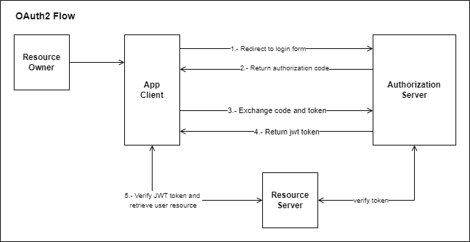

# oauth-example
Aplicación de ejemplo que usa OAuth y proporciona un servidor de autorización, un servido de recursos y un cliente.

Diagrama de Oauth2 Flow:

## oauth-server
Aplicación OAuth2 de servidor de autorización.

Para comprobar que el servidor de autorización ha arrancado correctamente podemos emplear la url: http://localhost:9000/.well-known/openid-configuration

### Aplicación Cliente de Pruebas
Como no tenemos una aplicación cliente registrada todavía, vamos a trabajar con una aplicación cliente de pruebas, esta aplicación de pruebas es: "https://oauthdebugger.com"

* En Authorize URI (required): http://127.0.0.1:9000/oauth2/authorize
* Redirect URI (required): https://oauthdebugger.com/debug
* Client ID (required): oidc-client
* Scope (required): profile  (openid siempre va), podemos poner también "read" o "write".

Al pulsar sobre el botón "Send Request" nos solicitará usuario y password (user/123456) que son los definidos en la clase SecurityConfig).

Nos devolverá el código de autorización "code", lo compiamos, ya que lo necesitamos enviar para intercambiarlo por el token.

Ahora desde un cliente REST (Postman, HTTPie, etc) llamamos a un endpoint "token_endpoint" propio del servidor de autorización:
* POST http://localhost:9000/oauth2/token

  Basic Auth

       username: oidc-client
       password: secret1234

  Body

       code: Bn_1biLIDuoo_RsnUSmbu_w_GCp2SQH7S6RBNCmTlJGMkZhjfdzACXvJUiBxA0M09aMFnDz78AI6O4496QApumDl0-I9jArB3v8aprj6e_qZKAMtBA749ra09RtKZepM
       grant_type: authorization_code
       redirect_uri: https://oauthdebugger.com/debug

Nos devolverá el "access_token" y el "refresh_token".

Ya tenemos nuestro servidor de autorización corriendo y funcionando.

## resource-server
Aplicación OAuth2 de servidor de recursos.

Endpoint (GET acceso con "read" o "write", POST acceso con "write"):

* GET/POST http://localhost:8081/resources/user

  Auth: Bearer <access_token>

## oauth-server
Aplicación OAuth2 cliente (sustituye a la aplicación cliente de pruebas https://oauthdebugger.com.

### Pasos de Prueba:
* Abrimos un navegador y ponemos la url de login definida en SecurityConfig http://127.0.0.1:8080//oauth2/authorization/oauth-client
* Introducimos el usuario y la contraseña (user/123456) y nos devolverá el "code" de autorización.
* Desde un cliente de API's REST (Postman, HTTPie, etc)

  Obtener el Token
    * POST http://127.0.0.1:9000/oauth2/token

      Basic Auth:

            username: oauth-client (ya no es "oidc-client" del cliente de pruebas)
            password: 1234679 (ya no es "secret1234" del cliente de pruebas)

      Body:

            code: el código devuelto antes
            grant_type: authorization_code
            redirect_uri: http://127.0.0.1:8080/authorized (ya no es https://oauthdebugger.com/debug que era la del cliente de prueba)
      Nos devolverá el "access_token" y el "refresh_token".

      Probamos el token
    * GET http://localhost:8081/resources/user

      Auth:

      Bearer <access_token>